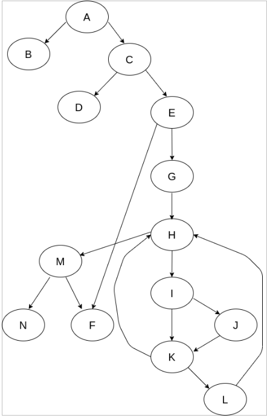
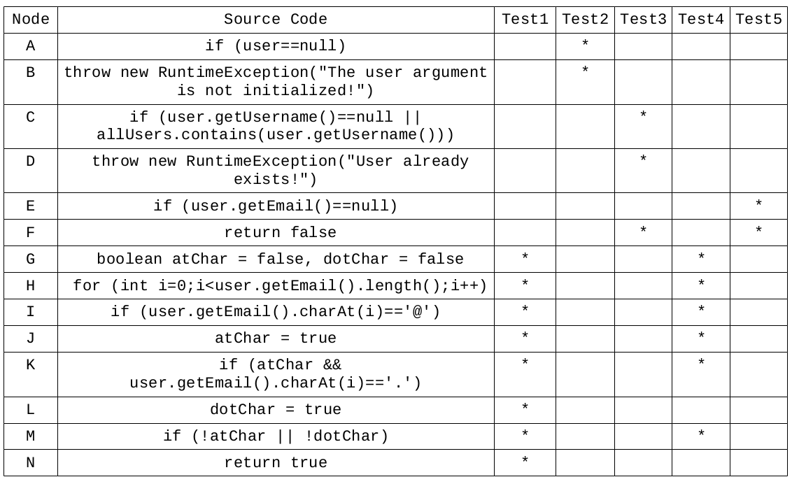
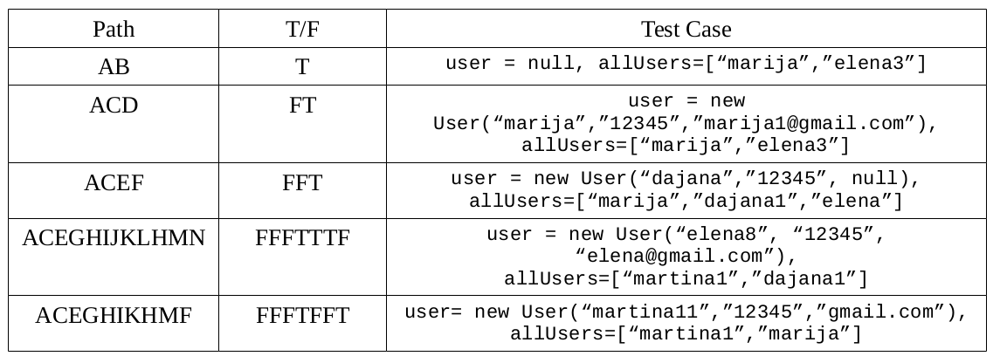

## **Втора Лаб. вежба по предметот Софтверско инженерство**
### **Мартина Илиева, 186052**
**Група на код** 
Ја добив групата на код 2.  

**Control Flow Graph** 
 

**Цикломатска комплексност** 
Цикломатската комплексност на овој код е 8, истата ја добив преку формулата P+1, каде што P е бројот на предикатни јазли. Во случајoв P=7, па цикломатската комплексност изнесува 8.  

**Тест случаи според критериумот Every statement**  
Test 1: user = new User(“martina”, “12345”, “martina@gmail.com”), allUsers=[“martina1”,”dajana1”] - **додавање на нов корисник** 
Test 2: user = null, allUsers=[“martina1”,”dajana1”,”elena”] - **нема иницијализиран корисник (референцата покажува кон null)** 
Test 3: user = new User(“martina1”,”12345”,”martina1@gmail.com”), allUsers=[“martina1”,”dajana1”] - **додавање на веќе постоечки корисник** 
Test 4: user= new User(“martina12”,”12345”,”martina@gmail”), allUsers=[“martina1”,”dajana1”] - **mail-от не е валиден, во овој случај нема “.”, но истото ќе важи и ако mail-от се напише без “@”, или без двете** 
Test 5: user = new User(“martina12”,”12345”, null), allUsers=[“martina1”,”dajana1”,”elena”] - **нема внесено mail** 
 

**Тест случаи според критериумот Every path** 
Path 1: кога инстанцата од класата User покажува кон null. 
Path 2: кога се иницијализира веќе постоечки корисник(username-от постои). 
Path 3: кога email-от е иницијализиран на null. 
Path 4: кога се иницијализира нов, непостоечки корисник. 
Path 5: кога mail-от не е внесен соодветно(нема “.” или ”@” или и двете). 
 

**Објаснување на напишаните unit tests** 
Ги пишував истите тестови од сликите погоре, така што секој тест враќа соодветно true, false или фрла exception.
